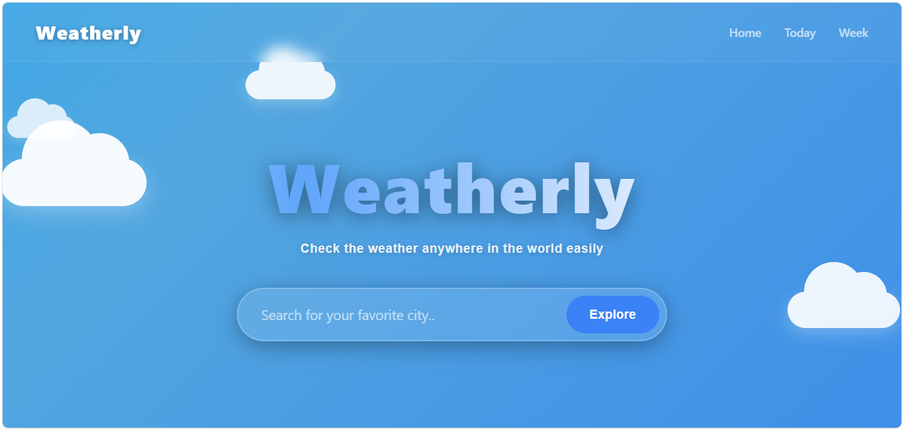
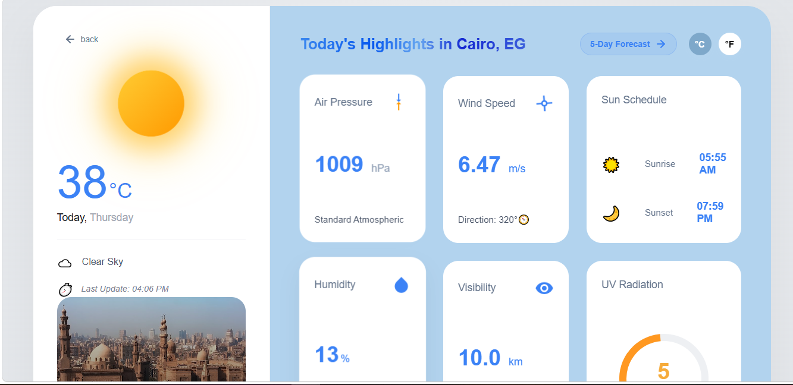
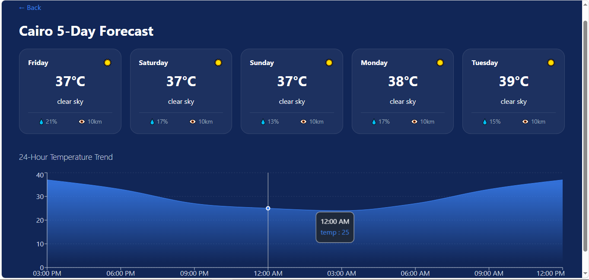

# 🌤️ Weatherly - Smart Weather Dashboard
---

## 📌 Project Idea
Weatherly is a fully responsive and modern web application dedicated to displaying real-time weather conditions and forecasts for any city worldwide. It provides users with an interactive, beautifully animated dashboard that translates complex meteorological data into clean, easy-to-read visual insights.

## 🎯 Project Goals
* **Accessibility:** Enable users to search and discover current weather conditions instantly and effortlessly.
* **Comprehensive Insights:** Provide a detailed "Today's Highlights" dashboard tracking critical metrics such as wind speed, humidity, atmospheric pressure, and visibility.
* **Future Planning:** Deliver a seamless 5-day weather forecast to help users plan ahead.
* **Dynamic UX:** Incorporate smooth CSS animations (like realistic moving cloud layers) and context-aware backgrounds to enhance user engagement.

## 💻 Tech Stack
* **Frontend Library:** React.js (Component-based architecture)
* **Routing:** React Router DOM (For smooth Single Page Application navigation)
* **HTTP Client:** Axios & Fetch API (For asynchronous API communication)
* **Weather Data Source:** OpenWeatherMap API (Current & 5-Day Forecast endpoints)
* **Styling & Animations:** CSS3 (Flexbox, Grid, keyframe animations, and responsive media queries)

## ✨ Key Features
* **Dynamic Location Search:** Instantly fetches and displays data for any globally recognized city.
* **Today's Highlights Dashboard:** Displays critical real-time data panels:
  * **Air Pressure** (in hPa) with trend indicators.
  * **Wind Speed** (in m/s) along with wind direction degrees.
  * **Sun Schedule** showing precise Sunrise and Sunset times.
  * **Humidity Percentage** with dynamic descriptive comfort levels.
  * **Visibility Range** converted into kilometers.
  * **UV Radiation Gauge** for sun safety.
* **5-Day Forecast Navigation:** A dedicated routing pathway leading to extended multi-day forecasting.
* **Fail-Safe Framework (Mock Data Mode):** Built-in robustness utilizing a structured `try/catch` mechanism. If the external API hits its rate limit or encounters connectivity issues, the application automatically triggers a smart presentation-safe data mode to ensure an uninterrupted evaluation experience.
* **Dynamic Theming:** The dashboard UI dynamically updates its visual imagery based on the queried city to maintain a rich contextual aesthetic.

---

## 📂 Project Structure
* **`public/`**: Static core assets including `index.html`, favicons, and the web app `manifest.json`.
* **`src/components/`**: Reusable modular UI elements such as the `SearchBar` component.
* **`src/pages/`**: Main page views governing application layout:
  * `Home`: The landing interface featuring the primary search system and layered animated clouds.
  * `Weather`: The main operational dashboard displaying contemporary metrics.
  * `Forecast`: The extended view dedicated to 5-day weather tracking.
* **`src/services/`**: Houses `weatherapi.js` which handles asynchronous network routing, parameter building, and raw JSON parsing.
* **`src/styles/`**: Centralized stylesheet directory management.

---

## 🚀 How to Run the Project Locally
1. **Clone the repository:**
   ```bash
   git clone <https://github.com/ItcProjects-R4/SHR4_SWD2_S1_PROJECT3>
   cd weather_app
   npm install
   npm start 
   ```
---
## 📸 Screenshots
| Landing Page (Home) | Weather Dashboard | 5-Day Forecast |
|---|---|---|
|  |  |  |

---
## 🛠️ Challenges & Solutions
Default Form Submission Refresh: Standard HTML forms reload the entire browser page upon submission, wiping out React application state.

 * Solution: Implemented e.preventDefault() inside the search submission handler to intercept the event, ensuring a fluid SPA (Single Page Application) experience.

Unpredictable Image API Outputs: Utilizing open-ended keyword tags occasionally fetched random background photos that disrupted layout consistency.

  * Solution: Streamlined query parameter sanitation using strict string formatting (trim().toLowerCase()) combined with targeted structural filters to keep backgrounds aligned with architectural and environmental themes.

API Rate Limiting During Live Presentations: Free-tier external APIs are prone to sudden timeouts or blockages, posing a risk during live evaluations.

   * Solution: Engineered an architectural fail-safe layer inside the data hook. When an API call fails, the catch block instantly populates the state with fallback metrics, guaranteeing that the application components never crash on stage.

## 🔮 Future Improvements
* **GPS Integration:** Leveraging the browser's Geolocation API to instantly display local weather upon initial load.
* **Dark/Light Mode:** Implementing global theme switching for personalized visual comfort.
* **Push Notifications:** Alerting users in real-time regarding critical or severe incoming weather alerts.

---

## 👥 Team Members
* **Aya Shoman** - Frontend & Logic Developer
* **Nada Reda** - UI/UX Designer & Frontend Developer
* **Menna Shaker** - QA Engineer & Software Tester
* **Maximos Helmy** - Core Logic & API Integration Specialist
* **Adel Abdelhalim** - Presentation & Documentation Specialist

---

## 🎬 Project Demo Video
[Click here to watch the full project presentation and walkthrough video](YOUR_VIDEO_LINK_HERE)

---
<p align="center">Developed with passion under the supervision of the Digital Egypt Pioneers Initiative (DEPI) / ITC 🇪🇬</p>